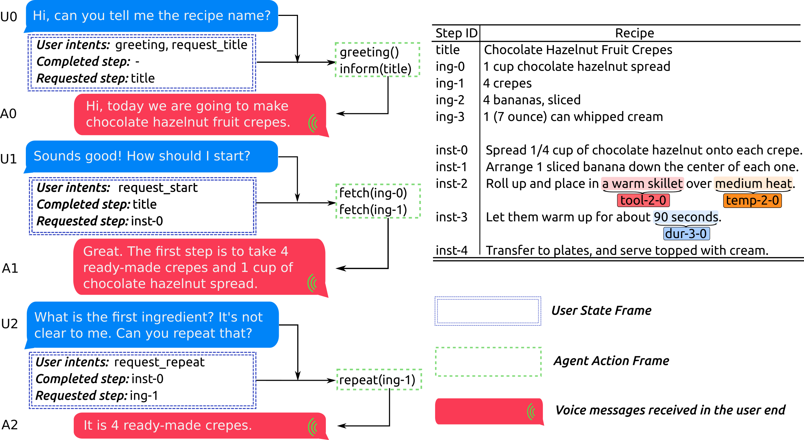

[](https://opensource.org/licenses/MIT)

# CookDial

We, [Text2Knowledge group](https://ugentt2k.github.io/), gladly present the first **Cook**ing **Dial**og dataset (**CookDial**), 
a task-oriented dialog dataset in which all the dialogs
are grounded in procedural documents (i.e. cooking recipes in our research).
It contains 260 dialogs and 260 corresponding recipes.
All the dialogs are collected in a human-to-human WoZ setting,
in which an agent tries to instruct a user to accomplish a cooking process
based on a recipe text. 
A typical cooking dialog is depicted in the figure below:
<p align="center">

</p>

This repo includes the CookDial dataset, preprocessing script
and baseline models for 3 challenging tasks, i.e.,

- Task-I: User Question Understanding
- Task-II: Agent Action Frame Prediction
- Task-III: Agent Response Generation

This text will guide you how to utilize CookDial and train your own model. Let's start!

## Dataset description

The structure of CookDial dataset is easy to understand.
More details about the data collection, statistics and annotation schema
can be found in [our paper](https://todo).

You can find all the recipes and dialogs in `./data/recipe/` and `./data/dialog/` respectively.
Recipes and dialogs are both stored individually (named from 000 to 259).

### Recipe data

Our recipe data is extended from the RISeC [dataset](https://github.com/YiweiJiang2015/RISeC) and its [paper](https://aclanthology.org/2020.aacl-main.82/).

Let's look into the [first recipe](./data/recipe/000_English_Walnut_Pie.json), the grounding document of [dialog-000](./data/dialog/000.1.json).
The first ingredient (_ing-0_) and first instruction (_inst-0_) are shown below:

```json
{
    "id": "ing-0",
    "text": "3 eggs",
    "type": "ingredient",
    "eamr": "( ing-0 \"3 eggs\" )"
}
```

```json
{
    "id": "inst-0",
    "text": "0) Preheat oven to 400 degrees F (205 degrees C).",
    "type": "instruction",
    "eamr": "( inst-0 / R\r\n\t:inform ( ac-0-0 \"Preheat\"@3:10 / AC\r\n\t\t:ppt ( tool-0-0 \"oven\"@11:15 / TOOL )\r\n\t\t:heat ( temp-0-0 \"400 degrees F\"@19:32 / TEMPERATURE )\r\n\t\t:heat ( temp-0-1 \"205 degrees C\"@34:47 / TEMPERATURE )\r\n\t)\r\n)"
}
```

The fields `id, text, type` speak for themselves.
The field `eamr` is a PENMAN string representation of the semantic graph within one ingredient or instruction sentence.
We borrow some ideas and notions from [Abstract Meaning Representation](https://amr.isi.edu/) project and call our recipe annotation Extended-AMR (EAMR).
Again, we wrote a parser [here](./src/utils/recipe_util.py) to parse eamr graphs.
A pretty-print version of the string above is:

```text
( inst-0 / R
	:inform ( ac-0-0 "Preheat"@3:10 / AC
		:ppt ( tool-0-0 "oven"@11:15 / TOOL )
		:heat ( temp-0-0 "400 degrees F"@19:32 / TEMPERATURE )
		:heat ( temp-0-1 "205 degrees C"@34:47 / TEMPERATURE )
	)
)
```

It represents a directed acyclic graph constituted by nodes and edges.
This figure may be more intuitive to help you understand the graph concept.


A pair of parentheses is the scope marker of one node, which is normally formatted as:

```text
(entity_identifier "mention_span"@mention_span_start:mention_span_end / node_label)
```

The central node in _inst-0_ is the verb "Preheat", whose entity identifier is "ac-0-0", node label (entity type) is AC (action),
mention span start and ends are (3, 10).
**Notice**: Since our dialog models focus on the entity level, we only need the eamr parser to 
extract related information from nodes (e.g. entity identifiers, mention spans).
In particular, entity identifiers bridge dialogs and recipes as we will see in the following [section](#action_frame). 

An edge and its label is indicated by a semi-colon like ":inform, :heat".
It can be interpreted as the relation between the predicate and its arguments.
For example, the relation between "oven" and "Preheat" is "ppt" (i.e. patient or object).
The edge information is not used in our current models but may contribute to the research in future.

### Dialog data

Take the [dialog-000](./data/dialog/000.1.json) as example.
It consists of 28 utterances.
Let's look at the first user utterance:

```text
{
    "utt_id": "utt-0",
    "utterance": "Hi. What's the first step I need to take?",
    "bot": false,
    "annotations": "{\"section\": \"inst\", \"intent\": \"greeting; req_start;\", 
                     \"tracker_requested_step\": \"inst-0\", \"tracker_requested_step_num\": 9,
                     \"tracker_completed_step\": \"title\", \"tracker_completed_step_num\": 0}"
}
```

The fields `utt_id, utterance` speak for themselves.
The field `bot` is a boolean, indicating whether the current utterance is produced by the agent or not (_false_ in this utterance).
The field `annotations` is a dumped dict of the **User State frame** annotations in which

- `intent` contains the user intents (i.e. _greeting_ and _req_start_ in this case)
- `tracker_requested_step` stores the requested recipe step within the current user question.
- `tracker_requested_step_num` is the actual index of `tracker_requested_step` in the recipe annotation.
- `tracker_completed_step` stores the completed recipe step before the current user question. (Note this is the first user question, we default the completed step as "title")
- `tracker_completed_step_num` is the actual index of `tracker_completed_step` in the recipe annotation.
- (Optional) `section` denotes which recipe section ('title': title, 'ing': ingredient list, 'inst': instruction) the user is asking about.

The following agent response is:

```json
{
    "utt_id": "utt-1",
    "utterance": "Could you preheat your oven to 400 degrees?",
    "bot": true,
    "annotations": "inform_instruction(inst-0);"
}
```

Since this utterance comes from the agent, `bot` is _true_.
The field `annotations` is the <a id="action_frame">**Agent Action Frame**</a> annotation.
For this agent response, the action frame only contains one agent act (i.e. _inform_instruction_) and
the argument pointer (_inst-0_) meaning that the agent's answer is grounded in the instruction of _inst-0_.

The strings (e.g. "_inform_instruction(inst-0);_") in **Agent Action Frame** are invented by ourselves.
To parse them, we wrote a simple parser [here](./src/utils/fparser.py) 
that will be used in the [preprocessing script](./src/scripts/preprocess.py).


## Model training / evaluation

### 1. Dependency

OS and GPU: Ubuntu 18.04, Nvidia-Tesla-V100 (32GB), cuda 11.4

Basic requirements: python>=3.9.1, torch>=1.7, transformers>=4.6.1

Run (it is suggested to install them in a new conda/venv environment):

```shell
# Install all the dependencies:
pip install -r ./src/requirements.txt
# Install the spacy dictionary 
python -m spacy download en_core_web_sm-2.3.1
```

### 2. Preprocess data

```shell
python scripts/preprocess.py --lowercase
```

The output files can be found in `data/processed/`.
By default, the output folder tree looks like this:
```text
processed/
├── dialog
│   └── cookdial_dialog_merged.json 
├── preprocess.log
└── vocab
    ├── vocab.agent_acts.json
    ├── vocab.intent.json
    ├── vocab.section.json
    └── vocab.words.json
```

### 3. Train

The code structure is adapted from a great [template project](https://github.com/victoresque/pytorch-template) 
where you can learn more about how to configure your model architecture and an experiment using json files under `./src/`.
In our case, the baseline models for the 3 tasks differ from each other, each model has its own configuration json file, 
namely `config_user_task.json, config_agent_task.json, config_gene_task.json`.
The `name` field in [`config_user_task.json`](./src/config_user_task.json) determines your experiment name and the save path.
You can group a bundle of experiments under one name to play with hyper-parameters.
Each experiment will have its unique time stamp (when the experiment starts) as the subfolder name (e.g. `./src/save/your_experiment_name/timestamp/`).
One example of a subfolder tree is:
```text
your_experiment_name
└── timestamp
    ├── config.json         # The saved experiment configuration that will be reloaded during the evaluation phase.
    ├── events.out.tfevents.2612939458.host_name.45294.0 # tensorboard log
    ├── info.train.log      # trainer log 
    └── models
        └── model-best.pth  # The saved checkpoint

```
The `seed` field assigns a random seed to all the random number generator used in our codes.
**Note**: this seed also influences the data split in our [data-loading pipeline](./src/dataloaders/dataloader.py). 
For instance, setting the seed to 12345 and 54321 will produce different train, valid and test sets.

Take Task-I User Question Understanding task as example.
We will show how to start a new training loop.

Run:

```shell
cd ./src
# Make sure train.sh is executable
# chmod 751 train.sh
./train.sh --config ./config_user_task.json --mode "train"
```

After the training stops (due to early stopping or reaches the maximum epochs),
saved checkpoints, training logs and experiment configuration can be found in `./src/save/your_experiment_name/`.
The default setting (`save_period=1e6`) means only the best checkpoint is saved
but you can configure this in the json file as you like, e.g. save the checkpoint every two epochs (`save_period=2`).

Tensorboard is also supported. To monitor the training (like losses, gradient norm, etc.) in real time, run:

```shell
tensorboard --logdir ./src/save/your_experiment_name
```

### 4. Evaluate your models

After the training/parameter-tuning is finished, you can evaluate your model on unseen data.
Assume your model is saved under `/save/your_experiment_name/timestamp/`.
Run:

```shell
cd ./src
resume_path="./save/your_experiment_name/timestamp/models/model-best.pth"
./train.sh --config ./config_user_task.json --mode "test" --resume ${resume_path}
```

Unlike the training phase, the `./config_user_task.json` in evaluation is used only for initialization
as the real configuration will be overridden by the saved config file attached to the checkpoint you want to resume,
e.g. `/save/your_experiment_name/timestamp/config.json`.

### 5. Use our checkpoints

Alternatively, you can also download and evaluate checkpoints generated from our side.
We upload 3 checkpoints for each task respectively.


| Task-I User Question Understanding     | Task-II Agent Action Frame Prediction        | Task-III Agent Response Generation     |
| ---------------------------------------- |----------------------------------------------| ---------------------------------------- |
| [seed_951867557_user_task_hist_5.tgz](https://bit.ly/3ocMjjv) | [seed_951867557_agent_task_hist_5.tgz](https://bit.ly/3jtIgwi) | [seed_951867557_gene_task_with_pointer_with_act_hist_5.tgz](https://bit.ly/3odmC2m) |

Still use Task-I as an example. Run:

```shell
cd ./src
# You can put them under a new folder `/src/save_external`
mkdir save_external
wget -q https://bit.ly/3ocMjjv -O ./save_external/seed_951867557_user_task_hist_5.tgz
tar -C ./save_external/ -xzf ./save_external/seed_951867557_user_task_hist_5.tgz
resume_path="./save_external/seed_951867557_user_task_hist_5/1011_035530/models/model-best.pth"
./train.sh --config ./config_user_task.json --mode "test" --resume ${resume_path}
```

The evaluation results of Task-I will be printed:

```text
intent                  fscore                         0.902945
                        precision                      0.915667
                        recall                         0.894236
tracker_completed_step  Accuracy                       0.946429
tracker_requested_step  Accuracy                       0.881696
```

## Citation

If our work is helpful, please cite
```text
@article{jiang2022cookdial,
  title={CookDial: a dataset for task-oriented dialogs grounded in procedural documents},
  author={Jiang, Yiwei and Zaporojets, Klim and Deleu, Johannes and Demeester, Thomas and Develder, Chris},
  journal={Applied Intelligence},
  pages={1--19},
  year={2022},
  publisher={Springer}
}
```

## Issues

Feel free to contact us (yiwei.jiang@ugent.be) or post issues here.
